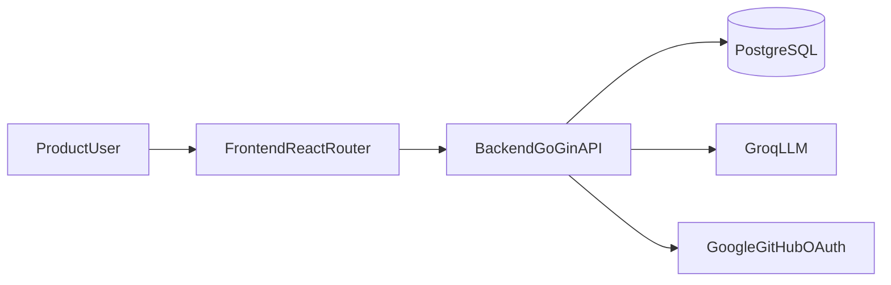

# HackBuddy


HackBuddy is an internal hackathon-intelligence platform that helps teams collect source material, generate structured analysis, and continue session-based conversations with AI assistance.

The repository contains:
- a Go backend API (authentication, sessions, source ingestion, analysis, chat, admin);
- a React Router frontend app (landing, auth, dashboard, admin);
- CI pipelines for both services.

## Architecture



## Repository Layout

```text
hackbuddy/
  .github/workflows/         # CI workflows (backend + frontend)
  backend/                   # Go API (Gin, GORM, Swagger)
  frontend/                  # React Router app (TS, Tailwind, Zustand, TanStack Query)
```

## Quick Start (Local Development)

### Prerequisites

- Go 1.24+
- PostgreSQL 15+
- Bun (recommended) or npm
- Docker (optional, for containerized backend stack)

### 1) Start the Backend

```bash
cd backend
cp .env.example .env
```

Set at least these values in `backend/.env`:
- `DATABASE_URL`
- `JWT_SECRET`
- `FRONTEND_URL` (frontend origin, e.g. `http://localhost:5173`)
- `BACKEND_URL` (backend origin, e.g. `http://localhost:8080`)

Run backend:

```bash
go run ./cmd/main.go
```

Or:

```bash
make run
```

### 2) Start the Frontend

```bash
cd frontend
bun install
```

Create `frontend/.env.local`:

```bash
VITE_API_URL=http://localhost:8080/api/v1
```

Run frontend:

```bash
bun run dev
```

The app is available at `http://localhost:5173`.

If you prefer npm, use:

```bash
npm install
npm run dev
```

## Docker Workflows (Backend)

From `backend/`:

Local stack:

```bash
make up-local
```

Shut down local stack:

```bash
make down-local
```

Production compose profile:

```bash
make up-prod
make down-prod
```

Notes:
- `docker-compose.yml` uses `backend/.env.local` as `env_file`.
- `docker-compose-prod.yml` uses `backend/.env.prod`.

## Core API Surface

Base API path: `/api/v1`

- Health: `GET /health`, `GET /health/db`
- Auth: `/api/v1/auth/*`
- Users: `/api/v1/users/*`
- Sessions: `/api/v1/sessions/*`
- Sources: `/api/v1/sessions/:id/sources`, `/api/v1/sessions/:id/chunks`
- Analysis: `/api/v1/sessions/:id/analyze`, `/api/v1/sessions/:id/analyses`
- Chat: `/api/v1/sessions/:id/chat`
- Admin: `/api/v1/admin/*`
- Swagger UI: `/docs/index.html`

For endpoint-level payload details, see `frontend/integration-docs.md`.

## Environment Variables

### Backend (`backend/.env` or `.env.local`)

Required in production:
- `APP_PORT`
- `APP_ENV=production`
- `DATABASE_URL`
- `JWT_SECRET` (minimum 16 chars)
- `FRONTEND_URL`
- `BACKEND_URL`

Optional integrations:
- `GROQ_API_KEY`, `GROQ_MODEL`, `GROQ_MAX_TOKENS`
- `GOOGLE_CLIENT_ID`, `GOOGLE_CLIENT_SECRET`
- `GITHUB_CLIENT_ID`, `GITHUB_CLIENT_SECRET`
- `SMTP_SERVER`, `SMTP_PORT`, `SMTP_USER`, `SMTP_PASSWORD`
- `RESEND_API_KEY`, `RESEND_FROM`
- `ALLOWED_SCRAPE_DOMAINS`

### Frontend (`frontend/.env.local`)

- `VITE_API_URL` (example: `http://localhost:8080/api/v1`)

## Development Commands

### Backend (`backend/`)

```bash
make test      # go test -v ./... -cover
make lint      # golangci-lint run ./...
make swagger   # regenerate Swagger docs
make build     # build backend binary
```

### Frontend (`frontend/`)

```bash
bun run typecheck
bun run build
bun run start
```

## Contributing (Internal)

This repository is private and maintained for internal collaboration.

Recommended branch workflow:

1. Branch from `dev` using `feature/*`, `fix/*`, or `chore/*`.
2. Open PRs into `dev` for normal development.
3. Use PRs into `main` for release/hotfix merges.
4. Ensure CI is green:
   - backend workflow: lint + tests
   - frontend workflow: typecheck + build
5. Request at least one internal reviewer before merge.

## Security and Operations Notes

- Never commit `.env` files or secrets.
- Backend currently runs migrations during startup; use controlled migration strategy for production operations.
- CORS should always use explicit `FRONTEND_URL` values in non-local environments.
- Rate limiting is in-memory; distributed deployments should use a shared limiter store.
- Restrict scraping scope with `ALLOWED_SCRAPE_DOMAINS` when operating in production.

## Additional Docs

- Backend notes: `backend/README.md`
- Frontend integration details: `frontend/integration-docs.md`
- Frontend template README: `frontend/README.md`

## License

This project is proprietary and confidential.

No open-source license is granted for this repository. This codebase is not MIT-licensed and may not be used, copied, modified, or distributed outside authorized internal use without explicit permission from the maintainers.
